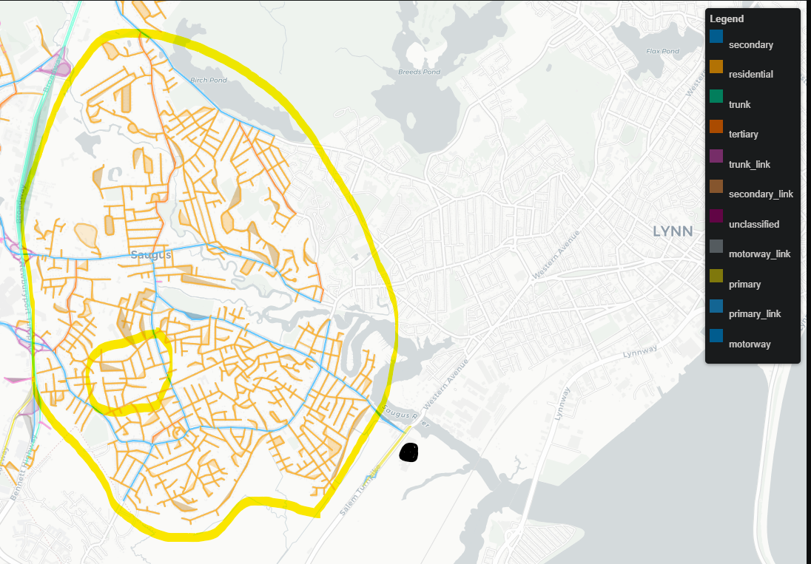

# Arc-Based Routing with Real Instances
This repo explores arc-based routing problems (ARP) starting from a small, real-world instance near me—based on the "John and Andreas" rural delivery example in Zhang & Tang (2017).
https://rui-zhang.org/wp-content/uploads/2017/09/The-windy-rural-postman-problem-with-a-time-dependent-zigzag-option.pdf

## Why Arc Routing?
- Most classical metaheuristics—simulated annealing, genetic algorithms, ant colony optimization—struggle with ARP, especially when compared to node-based routing.
- There’s less academic research on ARP than node-based routing (NRP), but that means more room for new methods.

- ARP models often:
  - Reflect real-world problems more accurately
  - Have smaller graph sizes
  - Involve tighter constraints and richer edge structure
 
# Project Plan
- Start with a small, real instance (John and Andreas)
- Apply metaheuristics, warm starts, and graph preprocessing as scale increases
- Eventually share graph routing visuals (likely on LinkedIn)

## Example screenshot of problem instance

